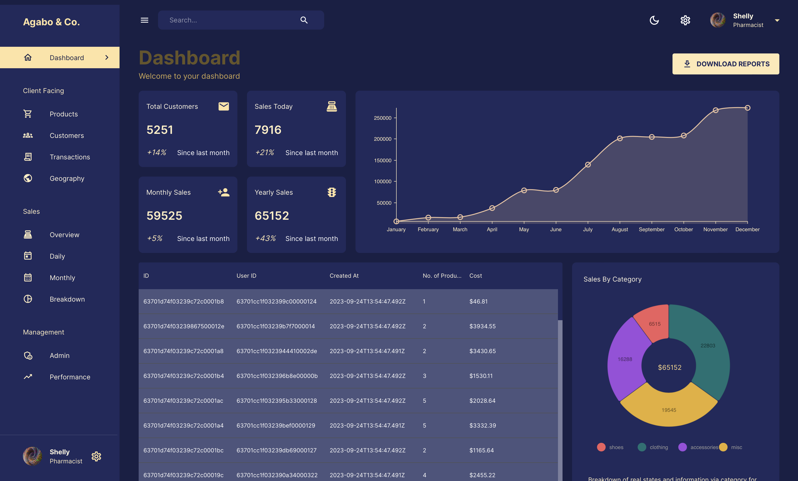

# ADMIN
------------

------------

## Introduction
This is a full-stack MERN build using the latest web development technologies around.
It's composed of both a front and back end where the later contains the data used on the front end of the app.
The frontend is developed using the Vite framework for faster build times. The backend on the other hand is developed simply using basic ReactJS framework.

The app is deployed on two platfroms; [Vercel](https://vercel.com) for the frontend; and; [Render](https://render.com) for the back or server side. 

## Packages

### Development
During development, install the following packages using the package manager of your choice.
> Try not to use different package managers for the client and server sides of the app. Stick to one, at most.

**Client Packages**
```bash
@emotion/react
@emotion/styled
@mui/icons-material
@mui/material
@mui/x-data-grid
@nivo/bar
@nivo/core
@nivo/geo
@nivo/line
@nivo/pie
@reduxjs/toolkit
@testing-library/jest-dom
@testing-library/react
@testing-library/user-event
dotenv
react
react-datepicker
react-dom
react-redux
react-router-dom
react-scripts
web-vitals
```
**Server Packages**
```bash
body-parser
cors
country-iso-2-to-3
dotenv
express
helmet
mongoose
morgan
nodemon
```

### Deployment

> For vite to generate a build folder during deployment, add this to your `vite.config.js` file.
>```javascript
>export default defineConfig({
>   {/**/},
>   build: {
>      outDir: "build",
>   },
>})
>```

**Client-side**
- Root directory : `client`
- Build command : `npm run build`
- Publish directory : `build`

**Server-side**
- Root directory : `server`
- Build command : `npm install`
- Run command : `npm run start`

> Don't forget to add the environment variables or secret files where necessary. As for the client-side, its url variable with be that of the server. Thus, deploy the server side first.

## Credits

All Credit 👏🏾 goes to **EdRoh** for building the original app on which what I based mine off of; it's exactly the same with some minor changes. 
To see the code base for the original app, here's the link to the github [repo](https://github.com/ed-roh/fullstack-admin.git). Make sure to leave a star.
In addition, watch the youtube [tutorial](https://youtu.be/0cPCMIuDk2I) and don't forget to like it if you do.

**Images**

[Mitul Grover](https://unsplash.com/@mitulgrover?utm_source=unsplash&utm_medium=referral&utm_content=creditCopyText) on [Unsplash](https://unsplash.com/photos/woXG3LK04sw?utm_source=unsplash&utm_medium=referral&utm_content=creditCopyText)
[Billing](https://icons8.com/icon/23735/billing) icon by [Icons8](https://icons8.com)
[Money Box](https://icons8.com/icon/114609/money-box) icon by [Icons8](https://icons8.com)
[Money Bag](https://icons8.com/icon/112793/money-bag) icon by [Icons8](https://icons8.com)

